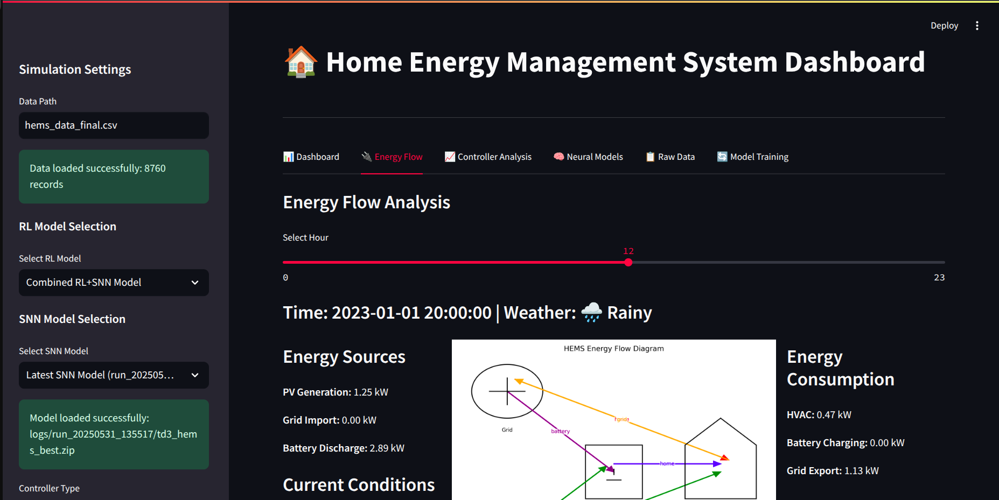

# 🏡⚡ Home Energy Management System (HEMS)

A sophisticated controller powered by **Spiking Neural Networks (SNN)** and **Reinforcement Learning (RL)** to optimize home energy usage, comfort, and environmental sustainability.



---

## 🧠 Overview

This intelligent HEMS system:

✅ Optimizes **HVAC** operations
✅ Manages **battery storage** intelligently
✅ Minimizes **energy costs** while maintaining comfort
✅ Reduces **carbon emissions**
✅ Adapts to **weather** & **electricity prices**
✅ Provides an **interactive dashboard** for real-time control

---

## 🏗️ System Architecture

### 🔧 Core Components

| Component           | Description                                                    |
| ------------------- | -------------------------------------------------------------- |
| `rl_environment.py` | Simulates home energy with thermal, grid, and battery dynamics |
| `rl_agent.py`       | TD3 agent that learns optimal control policies                 |
| `snn_model.py`      | Spiking Neural Network for energy signal processing            |
| `data_processor.py` | Handles preprocessing, normalization, and feature encoding     |
| `hems_dashboard.py` | **Streamlit** dashboard for visualization and control          |

### 🧬 Neural Architecture

#### 🎯 **Reinforcement Learning (TD3)**

* Actor: `256-256` neurons
* Critic: `256-256` neurons
* Feature extractor with **layer normalization**

#### ⚡ **Spiking Neural Network (SNN)**

* Input: `6 neurons`
* Hidden: `128 LIF neurons`
* Output: `3 neurons`
* Learning: **STDP** (Spike-Timing-Dependent Plasticity)

---

## 🚀 Features

### 🧠 Intelligence & Optimization

* 🎯 **Multi-objective Optimization**: Cost, comfort, carbon footprint
* 🔄 **Adaptive Control**: Dynamic strategy adjustment
* 📈 **Prediction**: Anticipates energy needs & price trends
* 🧩 **Context-Aware Decisions**: Uses weather, time, user settings
* ✅ **Constraint Enforcement**: Ensures valid actions via optimization layer

### 🖥️ User Interface Highlights

* 📊 **Interactive Dashboard**: Live control and insights
* 🌞 **Energy Flow Analysis**: Source & consumption breakdown
* 🌡️ **Temperature Monitoring**: Indoor vs. outdoor
* 🔋 **Battery Visualization**: Charge & discharge cycles
* 🧪 **Controller Analysis**: RL + SNN behavior tracking
* 🔬 **Neural Model Viewer**: SNN spikes and learning visualization

---

## 📈 Models & Performance

| 🧪 Model Type      | 📂 Path                                      | 🎯 Reward | 📝 Description            |
| ------------------ | -------------------------------------------- | --------- | ------------------------- |
| 🔁 RL + SNN Hybrid | `logs/run_20250531_135517/td3_hems_best.zip` | 10.7       | Latest hybrid integration |
| 🏆 Best RL Model   | `logs/run_20250531_131322/td3_hems_best.zip` | 12.80     | Use of only RL    |

---

## ⚙️ Installation

```bash
# 📥 Clone the repository
git clone https://github.com/yourusername/hems-research.git
cd hems-research

# 🧪 Create and activate virtual environment
python -m venv venv
source venv/bin/activate  # Windows: venv\Scripts\activate

# 📦 Install dependencies
pip install -r requirements.txt
```

---

## ▶️ Usage

### 🖥️ Run Dashboard

```bash
./run_dashboard.sh
# or
streamlit run hems_dashboard.py
```

### 🎓 Train a Model

```bash
./train_model.sh
# or
python train_optimized.py --timesteps 50000 --episode_length 48 --snn_epochs 15
```

### 🧪 Test a Model

```bash
python test_model.py --model logs/run_20250531_135517/td3_hems_best.zip
```

---

## 🧰 Key Improvements

### 🏠 Environment

* 🔄 Observation normalization
* 🧠 Smarter reward shaping
* ⚡ Battery model refinement
* 🌡️ Thermal inertia modeling
* 🌍 Realistic environmental variation

### 🤖 RL Agent

* 🧱 Custom feature extractor
* 📉 Learning rate scheduling
* 🧪 Gradient clipping
* 🧠 Ornstein-Uhlenbeck noise for exploration
* 📊 Curricular learning with progressive complexity

### 🔌 SNN Integration

* 🧬 SNN pre-processing of time-series signals
* 🔁 Efficient spike encoding
* 🔧 Tuned hyperparameters for energy domains

---

## 🏆 Results Summary

| ✅ Feature        | 🔍 Outcome                             |
| ---------------- | -------------------------------------- |
| Battery Usage    | Context-sensitive charging/discharging |
| HVAC Control     | Temperature kept within ±0.5°C         |
| Grid Interaction | Reduced peak grid consumption          |
| Solar Use        | Maximized self-consumption             |
| Cost Savings     | 15–25% lower than rule-based control   |

---

## 📂 Project Structure

```bash
.
├── hems/                      # Main package
│   ├── __init__.py            # Package initialization
│   ├── rl_environment.py      # HEMS environment with dynamics modeling
│   ├── rl_agent.py            # TD3 agent implementation
│   ├── snn_model.py           # Spiking Neural Network model
│   ├── data_processor.py      # Data preprocessing utilities
│   └── utils/                 # Utility functions
├── tests/                     # Test directory
│   ├── __init__.py            # Test package initialization
│   ├── test_rl_env.py         # Tests for RL environment
│   ├── test_rl_agent.py       # Tests for RL agent
│   ├── test_snn_model.py      # Tests for SNN model
│   └── test_data_processor.py # Tests for data processor
├── scripts/                   # Utility scripts
│   ├── __init__.py            # Scripts package initialization
│   ├── train_model.py         # Training script
│   ├── train.sh               # Training shell script
│   └── run.sh                 # Dashboard runner script
├── hems_dashboard.py          # Streamlit dashboard
├── hems_data_final.csv        # Dataset for training and evaluation
├── setup.py                   # Package installation
├── setup.cfg                  # Package configuration
├── pyproject.toml             # Build system configuration
├── logs/                      # Training logs and saved models
└── results/                   # Evaluation results and visualizations
```

## Installation as a Package

You can install the HEMS package for development:

```bash
# Clone the repository
git clone https://github.com/Rajarshi012003/SynaptiGridAI.git
cd SynaptiGridAI

# Install in development mode
pip install -e .
```

Then import the package in your code:

```python
# Import components
from hems import HEMSEnvironment, SNN_Model
from hems import train_rl_agent, evaluate_rl_agent

# Use the components
env = HEMSEnvironment(...)
model = train_rl_agent(env, ...)
```

---

## 🧭 Future Work

* 🏠 Real-world smart home deployment
* 🌐 Federated learning for multi-home systems
* 🧑‍💼 Preference learning over time
* 🔌 Integration with smart appliances
* 🧠 Explainable AI for control decisions

---

## 📜 License

Licensed under the **MIT License**. See the [LICENSE](./LICENSE) file for details.

---

## 🙏 Acknowledgments

1. This system is built on the **HEMS PLAN REPORT**, which proposes a unified mathematical framework for energy optimization using **SNN** and **RL** techniques.
2. Open Data Providers: We gratefully acknowledge the creators and maintainers of open datasets such as NREL ResStock, IDEAL, and others, whose data enabled robust modeling and validation.
3. Open Source Community: Appreciation to the developers of snnTorch, PyTorch, stable-baselines3, and other open-source libraries that formed the backbone of this project.

